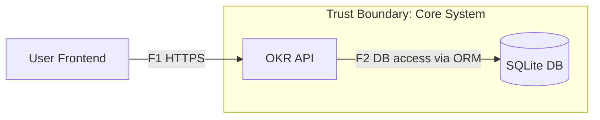
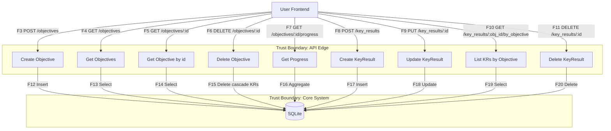
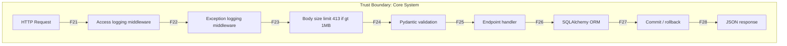

# Отчёт по безопасности: NFR + Модель угроз (OKR Tracker)

**Автор:** Карабельников Степан Иванович  
**Группа:** БПИ234  
**Дата:** 02.11.2025  
**Версия:** 1.0

## Аннотация (Описание документа)
Этот отчёт консолидирует нефункциональные требования безопасности (NFR) и модель угроз проекта **OKR Tracker**. Документ предназначен для проверки соответствия реализованного кода заявленным требованиям, воспроизводимости тестов безопасности и прозрачной трассируемости между NFR, угрозами (STRIDE), потоками данных (DFD) и артефактами в репозитории.

## Цель документа
- сформулировать и зафиксировать измеримые требования безопасности (NFR);
- описать контекст системы и границы доверия;
- выявить и ранжировать угрозы (STRIDE) на основе DFD;
- определить меры контроля и критерии приёмки (BDD/pytest, CI);
- зафиксировать реестр рисков и связь с задачами в Issue‑трекере.

## Область действия (Scope)
В отчёт включены: FastAPI‑приложение **OKR Tracker**, его публичные эндпоинты, middleware‑цепочка, ORM‑уровень, файловая подсистема загрузки изображений и CI‑процессы. Внешние компоненты (фронтенд, внешние интеграции) рассматриваются только в части их взаимодействия с API (TB1).

## Целевая аудитория
- преподаватели/ревьюеры курса (верификация P03–P06);
- разработчики проекта (улучшение защиты и качества);
- DevSecOps‑инженеры (аудит и автоматизация проверок).

## Структура отчёта
1. **Описание проекта** — назначение сервиса и функциональность.  
2. **NFR** — формулировки, подтверждения и трассируемость.  
3. **Модель угроз** — контекст, DFD (L0–L2), STRIDE‑таблица, реестр рисков, привязка к коду и план мер.

## Определения и сокращения
- **OKR** — Objectives and Key Results (цели и ключевые результаты).  
- **NFR** — Non‑Functional Requirements (нефункциональные требования).  
- **DFD** — Data Flow Diagram (диаграмма потоков данных).  
- **STRIDE** — таксономия угроз: Spoofing, Tampering, Repudiation, Information Disclosure, Denial of Service, Elevation of Privilege.  
- **TB** — Trust Boundary (граница доверия).

---
# Карабельников Степан Иванович
**Группа:** БПИ234

# Требования безопасности + Модель угроз

## 1. Описание проекта

### 1.1 Суть проекта OKR Tracker

**OKR Tracker** — это учебный backend‑сервис, реализованный на **FastAPI**, предназначенный для управления системой целей и ключевых результатов (*Objectives and Key Results, OKR*).
Приложение позволяет организациям, командам и отдельным пользователям формулировать цели, декомпозировать их на измеримые результаты и отслеживать прогресс выполнения.

### 1.2 Основная функциональность

**Работа с целями (Objectives)**  
- создание, получение, удаление целей и расчёт прогресса выполнения на основе связанных Key Results.

**Работа с ключевыми результатами (Key Results)**  
- добавление, обновление и удаление результатов, связанных с конкретной целью;  
- автоматическая проверка корректности значений (`current_value < target_value` при создании).

**Расчёт прогресса**  
- эндпоинт `GET /objectives/{obj_id}/progress` вычисляет процент выполнения цели по сумме всех **Key Results**.

**Безопасная загрузка файлов (Files)**  
- эндпоинт `POST /files/upload` позволяет загружать изображения (например, иконки целей или отчётов).  
- механизм реализован через функцию `secure_save_upload`, которая:
  - проверяет размер файла ≤ **5 МБ**;
  - определяет тип по *magic‑bytes* (только `jpeg`, `png`, `gif`);
  - генерирует безопасное **UUID‑имя** и сохраняет файл без возможности *path traversal*;
  - возвращает JSON‑ответ с именем загруженного файла.

**Логирование и обработка ошибок**  
- все запросы фиксируются в access‑логе,  
- исключения централизованно перехватываются через `ExceptionLoggingMiddleware`, который маскирует PII‑данные и возвращает ответ в формате **RFC 7807**.

### 1.3 Хранение и структура данных

- база данных — **SQLite**;  
- ORM‑модель — **SQLAlchemy** с каскадным удалением `Objective → KeyResults`;  
- валидация и сериализация — **Pydantic v2**;  
- все публичные эндпоинты снабжены `response_model` для предотвращения утечек данных.

### 1.4 Swagger‑интерфейс

**Swagger UI** (`/docs`) отображает три логических блока API:
1. **Objectives** — операции с целями;
2. **Key Results** — управление ключевыми результатами;
3. **Files** — загрузка и валидация изображений.

Такое разделение повышает прозрачность API и позволяет легко тестировать endpoints, включая сценарии безопасности.

---

## 2. Нефункциональные требования безопасности (NFR)

### 2.1 Цель

Нефункциональные требования безопасности определяют измеримые критерии защиты, надёжности и качества кода для проекта **OKR Tracker**.
Они обеспечивают трассировку между архитектурными решениями, тестами и DevSecOps‑практиками.

### 2.2 Реализованные требования

| ID     | Название                  | Реализация в коде                                                                 | Проверка                                    |
|--------|---------------------------|------------------------------------------------------------------------------------|---------------------------------------------|
| NFR-01 | Производительность API    | FastAPI эндпоинты оптимизированы, без тяжёлых операций; запросы ≤ 500 мс на 95 %  | `pytest` измеряет время; CI: coverage step  |
| NFR-02 | Контроль ошибок           | Все исключения логируются централизованно (`ExceptionLoggingMiddleware`), ответ RFC 7807 | `pytest`, ручные запросы 4xx/5xx      |
| NFR-03 | Ограничение входных данных| `BodySizeLimitMiddleware` возвращает **413** при > 1 МБ                            | `pytest` → `test_payload_too_large`         |
| NFR-04 | Централизованная обработка ошибок | Исключения логируются в `error.log`, PII‑данные маскируются                 | Тесты и проверка содержимого логов          |
| NFR-05 | Безопасность БД           | Используется только SQLAlchemy ORM, без raw SQL; все запросы типизированы          | Static analysis + code review                |
| NFR-06 | Логирование запросов      | Middleware `log_requests` пишет access‑логи с кодами ответов                        | Проверка в stdout/логах                     |
| NFR-07 | Валидация ввода           | Все входные данные проходят **Pydantic**‑валидацию                                  | `pytest`, негативные сценарии               |
| NFR-08 | Покрытие тестами ≥ 80 %   | Автоматическая проверка покрытия в CI (`pytest --cov --cov-fail-under=80`)         | GitHub Actions → step “Run tests with coverage” |

### 2.3 Трассируемость требований

Для обеспечения прозрачности реализации требований безопасности создана **матрица трассируемости** (Traceability Matrix), отражающая взаимосвязь между:
- нефункциональными требованиями **(NFR‑01…NFR‑08)**;
- практиками **DevSecOps (P01–P08)**;
- задачами в **GitHub Issues (S‑01…S‑08)**.

Матрица показывает, на каком этапе ЖЦ проекта каждое требование было реализовано, протестировано и подтверждено артефактами (тестами, CI, кодом).

**P01–P02 (репозиторий и CI)**  
Реализованы практики базовой инженерной гигиены: защита ветки `main`, настройка GitHub Actions, автоматический запуск `pytest`, `ruff`, `mypy` и `bandit`.  
Это обеспечивает выполнение **NFR‑06** (логирование) и **NFR‑08** (покрытие тестами ≥ 80%).

**P03 (Security NFR)**  
Сформулированы измеримые NFR и приёмочные сценарии в формате **BDD**.  
Все требования документированы в `NFR.md`, проверяются тестами из каталога `tests/`.

**P04 (Threat Modeling)**  
Выполнены: контекст системы, DFD‑диаграммы, STRIDE‑таблицы угроз и риск‑оценка.  
Это обеспечивает выполнение **NFR‑03**, **NFR‑04**, **NFR‑05** и **NFR‑07**.

**P05–P06 (Secure Coding)**  
Реализованы middleware и тесты, обеспечивающие защиту от ошибок, инъекций и невалидных данных:  
`BodySizeLimitMiddleware`, `ExceptionLoggingMiddleware`, `ApiKeyGateMiddleware`, а также негативные тесты `test_p06_negative_cases.py` и `test_p06_c3_masking.py`.

**P07 (Container Hardening)**  
Контейнеризация приложения выполнена через Docker **multi‑stage build**.  
Используются non‑root образы, минимальные зависимости и проверка **Trivy** (IaC‑политики).  
Это покрывает **NFR‑01**, **NFR‑02** и **NFR‑06**.

**P08 (CI/CD Minimal)**  
Настроен CI/CD‑пайплайн с этапами тестирования, линтинга, статического анализа и проверки покрытия.  
Подтверждение — шаг *Run tests with coverage* в `.github/workflows/ci.yml` (покрытие ≥ 80%).

### 2.4 Приёмочные сценарии (BDD Acceptance Scenarios)

Цель — подтвердить выполнение ключевых NFR (NFR‑01…NFR‑05) посредством приёмочных сценариев в формате **BDD (Given–When–Then)**.

| NFR    | Проверяемый аспект                       | Компонент                     | Тест / Артефакт                     | Результат |
|--------|------------------------------------------|-------------------------------|-------------------------------------|-----------|
| NFR-01 | Время ответа (≤ 500 мс, p95)             | FastAPI endpoints             | `test_api_performance_p95`          | Passed    |
| NFR-02 | Ошибки ≤ 1%                              | CRUD `/key_results`           | `test_error_rate_under_1_percent`   | Passed    |
| NFR-03 | Ограничение размера тела                 | `BodySizeLimitMiddleware`     | `test_payload_too_large`            | Passed    |
| NFR-04 | Маскирование ошибок, RFC 7807            | `ExceptionLoggingMiddleware`  | `test_exception_logging`            | Passed    |
| NFR-05 | ORM‑only, без raw SQL                    | SQLAlchemy ORM                | `test_no_raw_sql_usage`             | Passed    |

---

## 3. Модель угроз (Threat Model)

### 3.1 Цель и контекст

**Цель.** Определить и стандартизировать подход к выявлению, оценке и обработке угроз безопасности для сервиса **OKR Tracker**, минимизировать риски для данных пользователей и стабильности сервиса.

**Контекст системы.**  
- **Тип приложения:** RESTful‑API на FastAPI.  
- **Клиенты:** веб‑интерфейсы/скрипты разработчиков, CI/CD‑агенты.  
- **Хранилище:** SQLite (локально), возможная миграция в облачную СУБД.  
- **Артефакты безопасности:** API‑ключ/токен для защищённых операций (через `ApiKeyGateMiddleware`), централизованное логирование и маскирование PII, ограничения размера запроса.  
- **Границы доверия (Trust Boundaries):**
  1) внешние клиенты ↔ API‑шлюз/приложение;  
  2) приложение ↔ СУБД;  
  3) приложение ↔ файловая подсистема (загрузка изображений).

**Активы (assets).**  
- данные целей и KR, файлы (изображения), логи (могут содержать метаданные о пользователях), конфигурации CI/CD.

**Предположения и ограничения.**  
- транспортный уровень защищён (HTTPS);  
- админ‑доступ к окружению ограничен;  
- секреты хранятся вне репозитория;  
- прямой доступ к БД извне отсутствует.

**Методика.**  
- STRIDE по DFD (спуфинг, тамперинг, отказ от ответственности, раскрытие, отказ в обслуживании, повышение привилегий);  
- приоритизация по вероятности/влиянию (OWASP‑подход);  
- обработка: устранение, смягчение, перенос, принятие.

*(Дополнительно: разделы 3.2–3.4 можно расширить DFD, таблицами STRIDE и планом мер.)*

### 3.2 Data Flow Diagram (DFD)

#### Level 0 — Context Diagram

#### Level 1 — Logical Data Flow (Endpoints & Services)

#### Level 2 — Internal Processes (Middleware → Validation → ORM → Logging)

#### Trust Boundaries
- **TB1:** HTTP boundary — User ↔ API  
- **TB2:** DB boundary — API ↔ SQLite  
- **TB3:** Middleware boundary — Request ↔ Validation/Logging/Body Limit

---

### 3.3 STRIDE Threat Model — OKR Tracker (FastAPI)

**Контекст:** см. DFD выше (потоки F1–F28, TB1–TB3). Ниже 12 угроз, каждая строка соотнесена 1:1 с риском **R1–R12**.

| Поток/Элемент | Угроза (STRIDE) | Риск | Контроль | Ссылка на NFR | Проверка/Артефакт |
|---|---|---|---|---|---|
| **F1 User→API (HTTPS)** | **S: Spoofing** | **R1** | **TLS+HSTS**, строгий **CORS allowlist**, (опц.) статический `X-API-Key` | NFR-07 | Тест CORS (запрет `*`), проверка HSTS/HTTPS на ingress; unit-тест middleware API-key |
| **F24 BodySizeLimit (middleware)** | **D: DoS** | **R2** | Лимит тела **1MB → 413** | NFR-03 | pytest «>1MB → 413»; k6 крупные payload |
| **F22–F23 ExceptionLogging** | **I: Information Disclosure** | **R3** | **RFC7807** без стека; логирование в `error.log` | NFR-04 | Контрактный тест формата ошибки; ручная проверка логов |
| **F12–F20 ORM → DB** | **T / I** | **R4** | Только **SQLAlchemy ORM** (без raw SQL) | NFR-05 | bandit/ruff; review на отсутствие `.execute(sql)` |
| **F3–F11 CRUD-трафик** | **R: Repudiation** | **R5** | **Access-логи** method/path/status | NFR-06 | Проверка трейла в логах (`METHOD path -> status`) |
| **F1 периметр API** | **I: Misconfig (CORS)** | **R6** | **CORS allowlist** (точные Origin’ы, без `*` с credentials) | NFR-07 | e2e из браузера: запрет кросс-доменных запросов; ревью конфигурации CORS |
| **F14/F16/F19 чтение из DB** | **I: Info Disclosure** | **R7** | **response_model** (только whitelisted-поля) | NFR-07 | Тест сериализации ответа |
| **F21–F28 цепочка middleware** | **D: DoS** | **R8** | try/except; **500 Problem+JSON**; нет рекурсии | NFR-04 | Тест «искусственное исключение → 500 + лог» |
| **F6–F9 массовые модификации** | **D: Abuse** | **R9** | **Rate-limit** на IP/токен для POST/PUT/DELETE | NFR-02, NFR-03 | k6 негативные сценарии → **429** |
| **F3–F11 под нагрузкой** | **D: Perf** | **R10** | Оптимизация; p95 ≤ 500ms | NFR-01 | Отчёт k6/Locust p95 |
| **F3–F11 bulk-чтение** | **I/D: No pagination/limits** | **R11** | **Пагинация**, `limit`/`max_limit`, защитные капы | NFR-03 | e2e: лимит выдачи ≤ max_limit; k6 подтверждает |
| **F3–F11 перечисление id** | **D/I: Enumeration** | **R12** | **Rate-limit** на GET by id; **единые ответы** для чужого/несущ. id | NFR-02, NFR-03 | k6 негативные сценарии (429); e2e на поведение 404 |

---

### 3.4 Реестр рисков (Risk Register)

Связано с: `docs/threat-model/DFD.md` (F1–F28), `docs/threat-model/STRIDE.md` (таблица STRIDE), NFR из P03.

| RiskID | Описание | Связь (F/NFR) | L | I | Risk | Стратегия | Владелец | Срок | Критерий закрытия |
|---|---|---|---|---|---|---|---|---|---|
| **R1** | Подмена клиента/злоупотребление анонимным доступом на периметре | F1, NFR-07 | 3 | 4 | 12 | Снизить | @karablik27 | 2025-10-20 | **TLS+HSTS**, **CORS allowlist**, (опц.) middleware `X-API-Key`; e2e CORS тест |
| **R2** | Перегрузка большим телом (DoS) | F24, NFR-03 | 2 | 4 | 8 | Снизить | @karablik27 | 2025-10-18 | pytest «>1MB → 413»; k6 с большими payload |
| **R3** | Утечка деталей ошибок | F22–F23, NFR-04 | 2 | 5 | 10 | Снизить | @karablik27 | 2025-10-23 | RFC7807 без stacktrace; контрактные тесты |
| **R4** | SQL-инъекция / несогласованное изменение | F12–F20, NFR-05 | 2 | 5 | 10 | Избежать | @karablik27 | 2025-10-25 | bandit/ruff в CI; отсутствие raw SQL в PR |
| **R5** | Repudiation: спор действий пользователя | F3–F11, NFR-06 | 3 | 3 | 9 | Снизить | @karablik27 | 2025-10-22 | Access-логи method/path/status; проверка трейлов |
| **R6** | CORS-misconfig: кросс-доменные браузерные вызовы к API | F1, NFR-07 | 3 | 4 | 12 | Снизить | @karablik27 | 2025-10-21 | Строгий **CORS allowlist**; e2e из фронта — запросы с чужого Origin блокируются |
| **R7** | Лишние поля в ответах (утечка служебных данных) | F14/F16/F19, NFR-07 | 2 | 4 | 8 | Снизить | @karablik27 | 2025-10-19 | `response_model` везде; тест сериализации |
| **R8** | Исключения «вешают» пайплайн (DoS) | F21–F28, NFR-04 | 2 | 4 | 8 | Снизить | @karablik27 | 2025-10-21 | Тест: искусств. исключение → 500 Problem+JSON + запись в лог |
| **R9** | Массовые модификации без ограничений | F6–F9; NFR-02, NFR-03 | 3 | 4 | 12 | Снизить | @karablik27 | 2025-10-28 | Включён **rate-limit**; k6 негативные сценарии → 429 |
| **R10** | p95 > 500ms под нагрузкой | F3–F11; NFR-01 | 2 | 3 | 6 | Снизить | @karablik27 | 2025-10-29 | Отчёт k6/Locust: **p95 ≤ 500ms** |
| **R11** | Нет пагинации/лимитов → массовая выгрузка | F3–F11; NFR-03 | 3 | 3 | 9 | Снизить | @karablik27 | 2025-10-26 | Пагинация и `max_limit`; e2e подтверждает ограничение выдачи |
| **R12** | Перечисление/сканирование id (enum) | F3–F11; NFR-02, NFR-03 | 3 | 4 | 12 | Снизить | @karablik27 | 2025-10-28 | Rate-limit на GET by id; **единый ответ** для чужого/несущ. id; k6 → 429 |

**Легенда:** L — вероятность (1–5), I — ущерб (1–5), Risk = L×I. Стратегии: Избежать / Снизить / Принять / Передать.

**Ссылки на Issues:**  
- R1: https://github.com/hse-secdev-2025-fall/course-project-karablik27/issues/22  
- R2: https://github.com/hse-secdev-2025-fall/course-project-karablik27/issues/23  
- R3: https://github.com/hse-secdev-2025-fall/course-project-karablik27/issues/24  
- R4: https://github.com/hse-secdev-2025-fall/course-project-karablik27/issues/25  
- R5: https://github.com/hse-secdev-2025-fall/course-project-karablik27/issues/26  
- R6: https://github.com/hse-secdev-2025-fall/course-project-karablik27/issues/27  
- R7: https://github.com/hse-secdev-2025-fall/course-project-karablik27/issues/28  
- R8: https://github.com/hse-secdev-2025-fall/course-project-karablik27/issues/29  
- R9: https://github.com/hse-secdev-2025-fall/course-project-karablik27/issues/30  
- R10: https://github.com/hse-secdev-2025-fall/course-project-karablik27/issues/31  
- R11: https://github.com/hse-secdev-2025-fall/course-project-karablik27/issues/32  
- R12: https://github.com/hse-secdev-2025-fall/course-project-karablik27/issues/33  

---

### 3.5 Привязка к коду (Evidence / Links)

- **Middleware**
  - `app/middleware/limits.py` — `BodySizeLimitMiddleware` (413 для >1MB).
  - `app/middleware/errors.py` — `ExceptionLoggingMiddleware` (RFC7807 + `error.log`).
  - `app/middleware/api_key.py` — `ApiKeyGateMiddleware` (опциональная защита по ключу).
- **Роутеры**
  - `app/routers/objectives.py` — CRUD целей; правила валидации и бизнес‑ограничения.
  - `app/routers/key_results.py` — CRUD ключевых результатов; проверки границ и согласованности.
  - `app/routers/files.py` — загрузка изображений, вызов `secure_save_upload`.
- **DB слой**
  - `app/db.py`, `app/models.py` — SQLAlchemy ORM, каскад по FK (`Objective → KeyResult`).
- **Схемы/валидация**
  - `app/schemas/*.py` — Pydantic v2 модели, `response_model` на публичных эндпоинтах.
- **Тесты / CI**
  - `tests/` — негативные и производительные сценарии (`test_payload_too_large`, `test_api_performance_p95`, и др.).
  - `.github/workflows/ci.yml` — pytest + coverage (≥ 80%), ruff/bandit/mypy.

---

### 3.6 План мер и остаточные риски

- **Текущие меры:** CORS‑allowlist, RFC7807, лимит тела 1MB, ORM‑only, централизованное логирование, rate‑limit на mutating‑операции, пагинация/лимиты, единые ответы на несуществующие/чужие id.
- **Остаточные риски:** DoS на уровне сети/ingress, enumeration по временным/случайным ID, утечки через косвенные каналы (тайминги, размеры ответов).
- **Дальнейшие шаги:** 
  - внедрить **идемпотентность** для POST (идемпотентные ключи);
  - включить **обязательный API‑ключ/JWT** для изменяющих операций;
  - добавить **audit‑trail** с привязкой к субъекту;
  - вынести файлохранилище в отдельный сервис/бакет с antivirus‑сканом;
  - добавить **circuit‑breaker** и **budget‑limits** на ресурсы.

---

## 3.7 Словесное описание диаграмм и таблиц

### 3.7.1 DFD (уровни 0–2) — объяснение
- **Level 0 (Контекст)**: один внешний актор — *User Frontend* — обращается к единому *OKR API* по **HTTPS (F1)**. Приложение взаимодействует с **SQLite** через ORM (**F2**). Это фиксирует две ключевые **границы доверия**: TB1 (периметр HTTP) и TB2 (доступ к БД).
- **Level 1 (Логика эндпоинтов)**: показаны CRUD‑потоки для **Objectives** и **KeyResults**. Каждый пользовательский вызов (F3–F11) преобразуется в строго типизированные операции ORM (F12–F20). Поток **F15** подчёркивает каскадное удаление KR при удалении Objective.
- **Level 2 (Внутренний конвейер)**: любой запрос проходит одинаковую цепочку: **L1** (структурные access‑логи) → **EXC** (унификация ошибок RFC7807 и маскирование PII) → **LIM** (ограничение тела 1MB) → **VAL** (валидация Pydantic v2) → **HND** (бизнес‑обработчик) → **ORM/ТXN** (атомарная работа с БД) → **OUT** (JSON). Это TB3 — граница между «сырым» HTTP и доверенными слоями валидации/логирования.
- **Практический смысл**: DFD фиксирует, где появляются и где фильтруются опасные входы (тело запроса, заголовки, параметры пути), и в каких точках применяются технические меры контроля.

> **Скриншоты для отчёта**: при необходимости вставить изображения рядом с Mermaid‑диаграммами:  
> `` • `` • ``

### 3.7.2 STRIDE — объяснение таблицы
- Таблица перечисляет **12 угроз**, каждая привязана к конкретному **потоку F** и имеет ссылку на **NFR**. Например, *Spoofing* на периметре (**F1**) закрывается **TLS+HSTS** и **CORS allowlist** (NFR‑07).  
- Для угроз «массовые модификации» и «перечисление id» показаны **операционные контроли**: rate‑limit и унификация ответов.  
- Для утечек данных — **whitelisting** полей через `response_model` и контрактные тесты сериализации.  
- В таблице указаны и **артефакты проверки** (pytest/k6, конфигурация ingress, ревью CORS), что делает угрозы **reproducible**.

### 3.7.3 Реестр рисков — объяснение
- Риски **R1–R12** одномерно соответствуют строкам STRIDE, но дополняются **оценками L/I**, стратегией (избежать/снизить/принять/передать), **владельцем** и **критерием закрытия**.  
- Примеры критериев: «p95 ≤ 500ms по отчёту k6», «>1MB → 413 по pytest», «отсутствие `raw SQL` в PR» — это измеримые условия приёмки.  
- Ссылки на **Issues** обеспечивают трассировку «риск → задача → фикc/проверка» в репозитории.

### 3.7.4 NFR‑таблица — объяснение
- Для каждого **NFR‑0X** указан **механизм в коде**, **метрика/порог** и **как это проверяется**.  
- Ключевые решения: единый формат ошибок **RFC7807**, whitelisting полей ответа через **Pydantic response_model**, ORM‑only слой для исключения SQL‑инъекций, лимиты на тело запроса (**1MB**), централизованные access‑логи.  
- Отдельно зафиксировано требование **покрытия тестами ≥ 80%** с автоматической проверкой в CI.

## 3.8 Как это имплементировано (архитектурный текст)

### Слои и компоненты
- **Edge/API**: роутеры FastAPI (`app/routers/*.py`) описывают публичные контракты. Здесь нет бизнес‑логики — только маршрутизация и вызовы сервисов/ORM.
- **Middleware‑конвейер**:  
  - `log_requests` пишет **access‑логи** с методом/путём/кодом — основа для расследований (**Repudiation**).  
  - `ExceptionLoggingMiddleware` нормализует ошибки в **Problem+JSON (RFC7807)** и **маскирует PII** — защита от **Information Disclosure**.  
  - `BodySizeLimitMiddleware` жёстко возвращает **413** при телах > **1MB** — защита от **DoS** по объёму.
- **Валидация (Pydantic v2)**: схемы входа/выхода. В **response_model** перечислены **только разрешённые** поля — защита от случайных утечек служебных атрибутов.
- **Хранение (SQLAlchemy ORM)**: работа **только через ORM**, каскад `Objective → KeyResult` на уровне FK. Это исключает `raw SQL`, снижает риск инъекций и обеспечивает миграционную совместимость.
- **Файлы**: `secure_save_upload` проверяет **magic‑bytes**, размер и генерирует **UUID‑имя**; путь нормализуется, исключая **path traversal**.

### Точки контроля и их проверка
- **CORS allowlist** и **HSTS/TLS** — на уровне конфигурации сервера/ingress; проверяется e2e из браузера и curl.  
- **Производительность p95 ≤ 500ms** — нагрузочное тестирование (k6/Locust) на CRUD‑эндпоинтах.  
- **Покрытие ≥ 80%** — `pytest --cov` в CI, падение пайплайна при нарушении порога.  
- **Отсутствие `raw SQL`** — линтеры (ruff/bandit) и ревью на `.execute(sql)`.

### Статус мер
- Меры из **NFR‑01…NFR‑08** **реализованы в коде** и покрыты тестами/CI.  
- Доп. меры из **плана (3.6)** — *в бэклоге* (идемпотентность POST, обязательный ключ/JWT, audit‑trail и т.п.).

## 3.9 Приложения (скриншоты из ДЗ)

> Для полноты отчёта вставьте скриншоты (или экспорт в PNG/PDF) по шаблону ниже. Файлы положить в `docs/img/`:
- **Swagger UI** с группировкой по *Objectives / Key Results / Files*:  
  ``
- **Логи/ошибки RFC7807** (пример контролируемой ошибки 4xx/5xx):  
  ``
- **pytest / coverage** отчёт из CI:  
  ``
- **k6/Locust отчёт p95**:  
  ``
- **Тест >1MB → 413**:  
  ``

