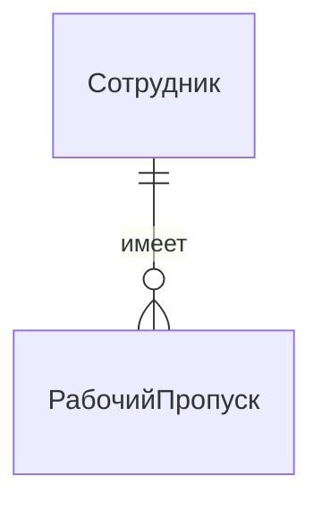

# **Контрольная работа (Midterm Exam) Теория**

# 1 - ER-диаграммы

## 1.Три уровня проектирования:

1.  **Концептуальная модель (Наш фокус сегодня):**
    *   **Что это?** Архитектурный эскиз. Верхнеуровневый чертеж, понятный и инженерам, и бизнесу.
    *   **На чем основан?** На требованиях бизнеса ("хотелках").
    *   **Инструмент:** **ER-диаграммы (Entity-Relationship Diagram).**

2.  **Логическая модель (Следующая лекция):**
    *   **Что это?** Детальный план этажей. Описание данных в виде таблиц, колонок, ключей, но без привязки к конкретной СУБД.

3.  **Физическая модель:**
    *   **Что это?** Строительная документация. Конкретная реализация для PostgreSQL, включая типы данных, индексы, партиционирование.

> Мы идем от общего к частному, от абстрактного к конкретному. Ошибки, допущенные на концептуальном уровне, стоят дороже всего.

---

## 2. Элементы ER-модели

ER-модель состоит всего из трех базовых элементов.

*   **Сущность (Entity):**
    *   **Что это?** Значимый для бизнеса объект реального (или выдуманного - в игре, например) мира. **Существительное.**
    *   *Примеры:* `Студент`, `Курс`, `Преподаватель`.
    *   Обозначение: Имя сущности в прямоугольной рамке

*   **Атрибут (Attribute):**
    *   **Что это?** Свойство или характеристика сущности.
    *   *Примеры:* `Имя` у Студента, `Название` у Курса.
    *   **Ключевой атрибут (Primary Key):** Атрибут, который уникально идентифицирует экземпляр сущности. Подчеркивается. *Пример:* `StudID`.
    *   Обозначение: Овал с надписью "Имя", соединенный с прямоугольником "Студент"

*   **Связь (Relationship):**
    *   **Что это?** Ассоциация между двумя или более сущностями. **Глагол.**
    *   *Пример:* Студент **изучает** Курс.
    *   Обозначение: Ромб с именем связи внутри, соединенный с двумя (или больше) прямоугольниками
---

## 3. Грамматика данных: Кардинальность

Просто соединить сущности недостаточно. Нужно описать **правила** этой связи.

**Кардинальность** отвечает на вопрос: "Сколько экземпляров одной сущности может быть связано со сколькими экземплярами другой?"

*   **Один-к-Одному (1:1):**
    *   Один `Сотрудник` имеет ровно один `РабочийПропуск`. Один `РабочийПропуск` назначен ровно одному `Сотруднику`.


*   **Один-ко-Многим (1:N):**
    *   Один `Отдел` включает **много** `Сотрудников`. Один `Сотрудник` принадлежит **одному** `Отделу`.
*   **Многие-ко-Многим (M:N):**
    *   Один `Студент` может изучать **много** `Курсов`. Один `Курс` могут изучать **много** `Студентов`.

> **Важно:** Связи M:N в физической модели превращаются в отдельную таблицу!
    
---

## 4. Продвинутые концепции ER 

### 4.1 Рекурсивная связь
Сущность, которая связана сама с собой.

*   **Бизнес-задача:** В компании есть сотрудники, и у каждого сотрудника (кроме гендиректора) есть ровно один руководитель. Руководитель — это тоже сотрудник.
*   **Решение:** Сущность `Сотрудник` связана сама с собой связью `руководит`.
*   **Кардинальность:** Связь 1:N. Один руководитель (сотрудник) может руководить многими подчиненными (сотрудниками). У одного подчиненного — один руководитель.

---

### 4.2 Слабая сущность
Сущность, которая не может существовать и быть уникально идентифицирована без родительской сущности.

*   **Бизнес-задача:** У нас есть `Здания`, у каждого свой уникальный ID. Внутри зданий есть `Помещения`. Номер помещения (например, "404") уникален только в пределах одного здания.
*   **Решение:**
    *   `Здание` — сильная сущность.
    *   `Помещение` — **слабая сущность**. Она не может существовать без здания.
    *   Связь `находится_в` называется **идентифицирующей**.
    *   Первичный ключ для `Помещения` — это **композитный ключ**: (`ID_Здания`, `Номер_Помещения`).
*   **Обозначение:** Слабая сущность и ее идентифицирующая связь рисуются двойной линией.


---

### 4.3 N-арная связь 
Связь, которая соединяет N (3+) сущностей.

*   **Бизнес-задача:** `Преподаватели` руководят `Проектами`, которые выполняют `Студенты`. Важно знать, какой именно преподаватель руководит каким студентом в рамках какого проекта.
*   **Почему нельзя две бинарные связи?** Если мы свяжем "Преподаватель руководит Студентом" и "Студент выполняет Проект", мы потеряем информацию о том, в рамках какого проекта осуществлялось руководство.
*   **Решение:** Создать одну тернарную связь `Руководство`, соединяющую все три сущности. У этой связи могут быть свои атрибуты, например, `Оценка`.

---

### 4.4 Генерализация и специализация (IS-A)
Механизм для моделирования иерархии "is a" (является). Аналог наследования в ООП.

*   **Бизнес-задача:** В университете есть `Студенты` и `Сотрудники`. У всех них есть общие атрибуты (`ID`, `Имя`, `Email`). Но у студентов есть `Номер_зачетки`, а у сотрудников `Должность`. При этом `Сотрудник` может быть `Преподавателем` или `Администратором`.
*   **Решение:**
    *   Создать родительскую сущность `Участник_Университета` с общими атрибутами.
    *   Создать дочерние сущности `Студент` и `Сотрудник`, которые "наследуют" атрибуты от родителя и добавляют свои уникальные.
    *   `Сотрудник`, в свою очередь, может быть родительской сущностью для `Преподавателя`.
*   **Обозначение:** Специальный символ — треугольник с надписью "ISA".

---


# 2 - Реляционная модель

## 1. Язык реляционной модели

Реляционная модель, предложенная Эдгаром Коддом, основана на простой и мощной идее: все данные представлены в виде таблиц.

| Формальный термин        | Аналог в СУБД              | Описание                                         |
| :----------------------- | :------------------------- | :----------------------------------------------- |
| **Отношение (Relation)** | **Таблица (Table)**        | Двумерная структура из строк и столбцов          |
| **Кортеж (Tuple)**       | **Строка (Row)**           | Один экземпляр данных (один студент, один заказ) |
| **Атрибут (Attribute)**  | **Столбец (Column)**       | Именованная характеристика данных                |
| **Домен (Domain)**       | **Тип данных (Data Type)** | Множество всех допустимых значений для атрибута  |
**Схема отношения (Relation Schema):** Это "заголовок" таблицы. Формально: `R(A1, A2, ..., An)`, где R — имя отношения, а Ai — его атрибуты.
*Пример: `Students(StudentID, FIO, BirthDate)`*

**Схема базы данных (Database Schema):** Это совокупность всех схем отношений в базе данных.

---
### **Виды ключей: Как мы идентифицируем данные**

Ключи — это не просто "уникальные поля". У них есть строгая иерархия.

1.  **Суперключ (Superkey):**
    *   **Определение:** *Любой* набор из одного или более атрибутов, значения которых уникально определяют каждый кортеж в отношении.
    *   *Пример для `Students(StudentID, FIO, Email)`:* `(StudentID)` — суперключ. `(Email)` — суперключ. `(StudentID, FIO)` — тоже суперключ (хоть и избыточный).

2.  **Потенциальный ключ (Candidate Key):**
    *   **Определение:** Это **минимальный** суперключ. То есть такой суперключ, из которого нельзя удалить ни одного атрибута без потери свойства уникальности.
    *   *Пример:* `(StudentID)` и `(Email)` — потенциальные ключи. А `(StudentID, FIO)` — нет, потому что FIO можно убрать, и уникальность сохранится.

3.  **Первичный ключ (Primary Key, PK):**
    *   **Определение:** Это тот **потенциальный ключ**, который разработчик базы данных выбрал в качестве основного идентификатора кортежей.
    *   *Выбор:* Обычно выбирают самый простой, стабильный и короткий ключ (часто это суррогатный id).

4.  **Альтернативный ключ (Alternate Key):**
    *   **Определение:** Любой потенциальный ключ, который **не** был выбран в качестве первичного.
    *   *Пример:* Если мы выбрали `StudentID` как PK, то `Email` становится альтернативным ключом. На него тоже нужно вешать ограничение `UNIQUE`.

#### **Внешний ключ (Foreign Key, FK)**
*   **Что это?** Атрибут (или группа атрибутов) в одной таблице, который ссылается на **первичный ключ** в другой таблице.
*   **Задача:** Установить и поддерживать связь между таблицами. Это и есть наш "клей".
*   **Пример:** `DepartmentID` в таблице `Employees` ссылается на `DepartmentID` в таблице `Departments`.
---
### **Ограничения целостности**

Это правила, которые не позволяют базе данных превратиться в "свалку" противоречивых данных.

| Тип ограничения                                      | Описание                                                                                                                                                                                                  | Пример в SQL                                                                            |
| :--------------------------------------------------- | :-------------------------------------------------------------------------------------------------------------------------------------------------------------------------------------------------------- | :-------------------------------------------------------------------------------------- |
| **1. Целостность доменов (Domain Integrity)**        | Значение каждого атрибута должно соответствовать его домену (типу данных).                                                                                                                                | `Age INT`, `BirthDate DATE`. Попытка вставить строку "Вася" в `Age` будет отклонена.    |
| **2. Целостность сущностей (Entity Integrity)**      | Ни один атрибут, входящий в состав **первичного ключа**, не может принимать значение `NULL`.                                                                                                              | `StudentID INT PRIMARY KEY`. Нельзя создать студента с `StudentID = NULL`.              |
| **3. Ссылочная целостность (Referential Integrity)** | Если в отношении R1 есть **внешний ключ (FK)**, ссылающийся на PK отношения R2, то значение этого FK в каждом кортеже R1 должно либо быть `NULL`, либо совпадать со значением PK некоторого кортежа в R2. | В таблице `Orders` есть `CustomerID`. Нельзя создать заказ для несуществующего клиента. |
| **4. Ограничения ключа (Key Constraints)**           | Никакие два кортежа в отношении не могут иметь одинаковых значений по атрибутам **потенциального ключа**.                                                                                                 | `Email VARCHAR(255) UNIQUE`. Нельзя создать двух пользователей с одинаковым email.      |

---

## 2. Алгоритм трансформации

Это почти механический процесс. Следуйте правилам, и вы получите корректную схему.
### Правило 1: Сильные сущности
Каждая сильная сущность на ER-диаграмме превращается в отдельную таблицу. Атрибуты сущности становятся столбцами этой таблицы.

**Students(<u>StudentID</u>, Name, Semester)**
**Lectures(<u>LecID</u>, Title, CP)**

---
### Правило 2: Связь Один-ко-Многим (1:N)
Ключ со стороны "1" **мигрирует** в таблицу на стороне "N" в качестве внешнего ключа.

```
// Таблица на стороне "1"
Departments(DepartmentID, Name)

// Таблица на стороне "N"
// DepartmentID "мигрировал" сюда как внешний ключ
Employees(EmployeeID, FIO, DepartmentID)
```
*Внешний ключ `Employees.DepartmentID` ссылается на `Departments.DepartmentID`.*

---
### Правило 3: Связь Многие-ко-Многим (M:N)
Такие связи нельзя реализовать напрямую. Мы создаем **третью, ассоциативную (связующую) таблицу**.

*   Первичный ключ этой новой таблицы получается как **композиция** первичных ключей из двух исходных таблиц.
*   Если у самой связи были атрибуты (например, "оценка" в связи "студент-изучает-курс"), они становятся столбцами в этой новой таблице.

```
Students(StudentID, FIO)
Courses(CourseID, Title)

// Новая ассоциативная таблица
Enrollments(StudentID, CourseID, Grade) 
```
*Первичный ключ таблицы `Enrollments` (`StudentID`, `CourseID`).*
*`Enrollments.StudentID` ссылается на `Students.StudentID`.*
*`Enrollments.CourseID` ссылается на `Courses.CourseID`.*

---
### Правило 4: Связь Один-к-Одному (1:1)
Есть два основных подхода:

1.  **Слияние:** Если связь обязательна с обеих сторон (каждый сотрудник *обязан* иметь паспорт), можно объединить сущности в одну таблицу.
2.  **Миграция ключа (как в 1:N):** Более гибкий вариант. PK одной таблицы становится FK в другой. Чтобы сохранить ограничение 1:1, на столбец с внешним ключом нужно добавить ограничение `UNIQUE`.

---
### Правило 5: Слабые сущности
Слабая сущность также становится таблицей, но ее первичный ключ **всегда составной**.

*   Он включает в себя **первичный ключ родительской (сильной) сущности** и **частичный ключ** самой слабой сущности.

```
Buildings(BuildingID, Address)

// PK родителя (BuildingID) становится частью PK дочерней таблицы
Rooms(BuildingID, RoomNumber, Capacity) 
```
*Первичный ключ таблицы `Rooms` (`BuildingID`, `RoomNumber`).*
*`Rooms.BuildingID` также является внешним ключом к `Buildings.BuildingID`.*

---
### Правило 6: Иерархии ISA (Наследование)
Есть три стратегии. Выбор зависит от специфики задачи (что важнее: скорость запросов, отсутствие `NULL` или целостность).

1.  **Одна большая таблица:** Создать одну таблицу для родительской сущности, включив в нее атрибуты всех дочерних. Добавить столбец `EntityType` (`'Student'`, `'Professor'`).
    *   **Плюс:** Нет `JOIN`'ов. Быстро.
    *   **Минус:** Много `NULL`-значений.

2.  **Таблица на каждый "лист":** Создать таблицы только для конечных дочерних сущностей (`Students`, `Assistants`). Общие атрибуты родителя дублируются в каждой.
    *   **Плюс:** Нет `NULL`'ов.
    *   **Минус:** Дублирование схемы. Сложно запросить всех "людей" сразу.

3.  **Таблица на каждую сущность (самый "правильный"):** Создать таблицу для родителя и для каждого потомка. Дочерние таблицы содержат только свои уникальные атрибуты и внешний ключ, ссылающийся на PK родителя.
    *   **Плюс:** Максимальная нормализация, нет дублирования и `NULL`'ов.
    *   **Минус:** Требуются `JOIN`'ы для получения полной информации.
---
### Правило 7: Атрибуты связей

Переносятся в ассоциативные таблицы (для M:N) или в таблицу на стороне "N" (для 1:N).

---
### **Сводка правил трансформации**

*   **Правило 1 (Сильные сущности):** Превращаются в отношения. Выбор PK реализует **ключевое ограничение** и **целостность сущностей**.
*   **Правило 2 (Связь 1:N):** Миграция PK со стороны "1" в качестве FK на сторону "N". Это напрямую реализует **ссылочную целостность**.
*   **Правило 3 (Связь M:N):** Создание ассоциативного отношения, чей PK является композицией PK исходных отношений. Каждый из этих компонентов является FK, реализуя **ссылочную целостность** с обеими таблицами.
*   **Правило 4 (Связь 1:1):** Миграция ключа с установкой `UNIQUE` на FK. `UNIQUE` реализует **ключевое ограничение**, а сам FK — **ссылочную целостность**.
*   **Правило 5 (Слабые сущности):** PK родителя мигрирует и становится частью PK потомка. Это особый случай, где один и тот же столбец является частью PK (обеспечивая **целостность сущностей**) и одновременно FK (обеспечивая **ссылочную целостность**).
*   **Правило 6 (Иерархии ISA):** В варианте "таблица на сущность" PK родителя мигрирует в дочерние таблицы, где он является одновременно и PK, и FK.
*   **Правило 7 (Атрибуты связей):** Переносятся в ассоциативные таблицы (для M:N) или в таблицу на стороне "N" (для 1:N).

---

# 3 Разница между ER-моделью и логической моделью

## 1. Концептуальная модель (ER-модель)

Вопрос: что мы храним?

ER-модель описывает предметную область на уровне смыслов, без привязки к SQL.
Она отвечает на вопрос: какие сущности существуют и как они связаны?

ER включает:
- Сущности (Entity) – объекты предметной области
  Примеры: Студент, Курс, Преподаватель
- Атрибуты (Attribute) – свойства сущностей
  Примеры: имя, бюджет, адрес
- Ключевые атрибуты – уникальные идентификаторы
  Пример: StudentID
- Связи (Relationship) – ассоциации между сущностями
  Пример: Студент изучает Курс
- Кардинальности (1:1, 1:N, M:N)
- ISA (наследование)

ER-модель не содержит:
- таблиц
- столбцов
- типов данных
- внешних ключей
- ограничений NOT NULL, UNIQUE, CHECK
- индексов
- SQL-конструкций

---

## 2. Логическая модель (Реляционная модель)

Вопрос: как это хранится в базе?

Логическая модель – это реализация концептуальной модели в виде структуры таблиц.

Логическая модель включает:
- Таблицы (Relations)
- Столбцы (Columns)
- Типы данных (INT, VARCHAR, DATE…)
- Первичные ключи (PK)
- Внешние ключи (FK)
- Ограничения целостности:
  - Domain integrity (типы данных)
  - Entity integrity (PK не NULL)
  - Referential integrity (FK должны ссылаться на существующие PK)
  - Key constraints (нельзя дублировать значения потенциальных ключей)
- Ассоциативные таблицы для M:N связей
- Стратегии реализации ISA (одна таблица, таблицы-листы, таблица на каждую сущность)

---

## 3. Главная разница

ER → уровень смыслов  
Logical → уровень таблиц

ER-модель отвечает на вопрос «что существует?»,  
логическая модель – «как это реализовать в СУБД?».

Пример:
ER: Студент — записан → Курс (M:N)  
Logical: Students, Courses, Enrollments(StudentID, CourseID)

---

## 4. Краткая формула

ER = сущности + атрибуты + связи + кардинальности  
Logical = таблицы + столбцы + PK/FK + типы данных + ограничения


# 4 SQL запросы и прочие

### **Часть 1: DDL (Data Definition Language) - Язык архитектора**

DDL - это команды, которыми мы описываем **структуру** нашей базы данных. Это не про данные, это про **контейнеры для данных**. Ошибки на этом уровне - самые дорогие.

#### **1.1 Фундамент - Типы данных: Больше, чем просто хранение**

Выбор типа данных - это не вопрос экономии пары байт. Это **первый и самый важный контракт целостности** для ваших данных.

| Категория              | Тип (Примеры PostgreSQL)                                                                             | Ключевые соображения и подводные камни                                                                                                                                                                                                                                                                                                                                                                                      |
| :--------------------- | :--------------------------------------------------------------------------------------------------- | :-------------------------------------------------------------------------------------------------------------------------------------------------------------------------------------------------------------------------------------------------------------------------------------------------------------------------------------------------------------------------------------------------------------------------- |
| **Числовые**           | `SMALLINT`, `INTEGER`, `BIGINT`, `SERIAL` / `BIGSERIAL`, `NUMERIC(p, s)`, `REAL`, `DOUBLE PRECISION` | **Точность vs. Производительность:** `NUMERIC` абсолютно точен для финансовых расчетов (нет ошибок округления), но медленнее, чем `DOUBLE PRECISION` (числа с плавающей точкой). **Никогда не храните деньги в `FLOAT`/`DOUBLE`!** `SERIAL` - это не тип, а синтаксический сахар для автоинкрементного `INTEGER` с последовательностью (`sequence`).                                                                        |
| **Символьные**         | `CHAR(n)`, `VARCHAR(n)`, `TEXT`                                                                      | **`CHAR(n)`** всегда занимает `n` байт, дополняя пробелами. Используйте только для строк фиксированной длины (коды стран 'US', хеши 'md5'). **`VARCHAR(n)`** занимает реальную длину + overhead. `n` - это **ограничение**, а не выделение памяти. **`TEXT`** - для строк произвольной длины. В PostgreSQL `VARCHAR(n)` и `TEXT` работают практически одинаково по производительности, `n` - это просто `CHECK` constraint. |
| **Дата и время**       | `DATE`, `TIME`, `TIMESTAMP`, `TIMESTAMPTZ` (timestamp with time zone)                                | **Часовые пояса - это критично.** `TIMESTAMP` хранит "наивное" время (то, что вы вставили). `TIMESTAMPTZ` хранит момент времени в UTC, конвертируя его из часового пояса сессии при вставке и обратно при выборке. **Почти всегда используйте `TIMESTAMPTZ`** для любых глобальных данных, чтобы избежать неоднозначности.                                                                                                  |
| **Логические**         | `BOOLEAN`                                                                                            | Хранит `true`, `false` или `NULL` (трехзначная логика). Гораздо эффективнее и семантически правильнее, чем `INTEGER` 0/1.                                                                                                                                                                                                                                                                                                   |
| **Бинарные**           | `BYTEA`                                                                                              | Для хранения сырых бинарных данных (изображения, файлы), если нет возможности хранить их в S3 или другом файловом хранилище.                                                                                                                                                                                                                                                                                                |
| **Специализированные** | `UUID`, `JSON`/`JSONB`, `ARRAY`, `INET` (IP-адреса), `TSVECTOR` (полнотекстовый поиск)               | **`UUID`** - отличный выбор для первичных ключей в распределенных системах. **`JSONB`** - бинарная, индексируемая версия `JSON`. Позволяет эффективно запрашивать и индексировать вложенные структуры, стирая грань между реляционным и документным подходом.                                                                                                                                                               |

#### **1.2 Встроенные функции**

Встроенные функции позволяют выполнять сложные трансформации прямо на стороне базы, что часто гораздо эффективнее, чем извлекать "сырые" данные и обрабатывать их в приложении.

| Категория                      | Примеры функций (PostgreSQL)                                                                                               | Типичные сценарии использования                                                                                                                                                                                                                                                                                                                      |     |                                                                                                                                                                                                                           |
| :----------------------------- | :------------------------------------------------------------------------------------------------------------------------- | :--------------------------------------------------------------------------------------------------------------------------------------------------------------------------------------------------------------------------------------------------------------------------------------------------------------------------------------------------- | --- | ------------------------------------------------------------------------------------------------------------------------------------------------------------------------------------------------------------------------- |
| **Строковые функции**          | `LENGTH()`, `LOWER()`, `UPPER()`, `TRIM()`, `SUBSTRING()`, `POSITION()`, `CONCAT()`, `COALESCE()`, `NULLIF()`              | **Очистка и нормализация:** `UPDATE users SET email = LOWER(TRIM(email));` <br> **Извлечение частей:** `SUBSTRING(fio FROM POSITION(' ' IN fio) + 1)` для получения имени. <br> **Безопасное объединение:** `CONCAT(first_name, ' ', last_name)` (в отличие от `                                                                                     |     | `, не возвращает `NULL`, если один из аргументов `NULL`). <br> **Работа с `NULL`:** `COALESCE(middle_name, 'N/A')` - вернуть первое не-NULL значение. `NULLIF(value, '')` - вернуть `NULL`, если `value` - пустая строка. |
| **Числовые функции**           | `ABS()`, `ROUND()`, `CEIL()`, `FLOOR()`, `RANDOM()`                                                                        | **Округление:** `ROUND(price * 1.2, 2)` для вычисления цены с НДС. <br> **Генерация случайных данных:** `ORDER BY RANDOM() LIMIT 10` для получения случайной выборки (неэффективно на больших таблицах!).                                                                                                                                            |     |                                                                                                                                                                                                                           |
| **Функции для даты и времени** | `NOW()`, `CURRENT_DATE`, `CURRENT_TIME`, `DATE_TRUNC('month', ...)` `EXTRACT(YEAR FROM ...)` `AGE(...)` `INTERVAL '1 day'` | **Фильтрация по периодам:** `WHERE created_at >= NOW() - INTERVAL '30 days'`. <br> **Группировка:** `GROUP BY DATE_TRUNC('week', registration_date)` для построения отчетов по неделям. <br> **Извлечение компонентов:** `EXTRACT(DOW FROM my_date)` для получения дня недели. <br> **Вычисления:** `AGE(birth_date)` для расчета текущего возраста. |     |                                                                                                                                                                                                                           |
| **Функции для `JSONB`**        | `->`, `->>`, `#>`, `@>`, `jsonb_build_object()`, `jsonb_agg()`                                                             | **Извлечение данных:** `my_json_column ->> 'name'` для получения значения поля `name` как текста. <br> **Проверка наличия:** `WHERE my_json_column @> '{"city": "Moscow"}'` - найти все записи, где JSON содержит указанный ключ-значение. <br> **Агрегация:** `jsonb_agg(my_row)` - собрать все строки в один JSON-массив.                          |     |                                                                                                                                                                                                                           |
| **Функции приведения типов**   | `CAST(column AS type)` или `column::type`                                                                                  | `CAST(total_sum AS NUMERIC(12,2))`. Особенно важно при делении целых чисел: `(5::NUMERIC / 2)` вернет `2.5`, а `(5 / 2)` вернет `2`.                                                                                                                                                                                                                 |     |                                                                                                                                                                                                                           |

> **Инженерный подход:** Прежде чем писать сложную логику обработки данных в приложении, всегда проверяйте, нет ли в вашей СУБД встроенной функции, которая делает это эффективнее.

#### **1.3 `CREATE TABLE`: Проектирование контракта**

Создание таблицы - это определение ее **контракта целостности** через `constraints`.

```sql
CREATE TABLE Employees (
    -- Определение колонок и их доменов
    EmployeeID      SERIAL PRIMARY KEY, -- SERIAL = INT + NOT NULL + UNIQUE + автоинкремент
    FIO             VARCHAR(255) NOT NULL,
    Email           VARCHAR(255) NOT NULL UNIQUE, -- Альтернативный ключ
    DepartmentID    INT,
    Salary          NUMERIC(10, 2) NOT NULL CHECK (Salary > 0), -- Ограничение-проверка
    HireDate        DATE NOT NULL DEFAULT CURRENT_DATE,

    -- Определение ограничений на уровне таблицы
    CONSTRAINT fk_department
        FOREIGN KEY (DepartmentID)
        REFERENCES Departments(DepartmentID)
        ON DELETE SET NULL -- Что делать при удалении связанного отдела
        ON UPDATE CASCADE  -- Что делать при обновлении ID связанного отдела
);
```

**Ключевые элементы контракта:**
*   `NOT NULL`: Гарантирует наличие значения.
*   `UNIQUE`: Гарантирует уникальность значения в столбце (для альтернативных ключей).
*   `PRIMARY KEY`: Комбинация `NOT NULL` и `UNIQUE`. Главный идентификатор.
*   `FOREIGN KEY`: Обеспечивает **ссылочную целостность**.
    *   `ON DELETE`: Поведение при удалении родительской записи.
        *   `RESTRICT` / `NO ACTION` (по умолчанию): Запретить удаление, если есть связанные записи.
        *   `CASCADE`: Удалить все связанные записи "каскадом". Опасно!
        *   `SET NULL`: Установить `NULL` в дочерних записях.
        *   `SET DEFAULT`: Установить значение по умолчанию.
    *   `ON UPDATE`: Поведение при изменении PK родительской записи (редкая операция).
*   `CHECK`: Любое произвольное логическое условие на значение в строке. `CHECK (EndDate > StartDate)`.
*   `DEFAULT`: Значение по умолчанию, если оно не указано при вставке.


## Часть 2: DML (Data Manipulation Language) - Язык для работы с состоянием

DML - это команды, которыми мы изменяем **содержимое** таблиц.

#### **2.1 `INSERT`: Создание новых строк**

```sql
-- Вставка одной строки с явным указанием колонок
INSERT INTO Employees (FIO, Email, DepartmentID, Salary)
VALUES ('Иванов Иван Иванович', 'ivanov@company.com', 10, 60000.00);

-- Вставка нескольких строк (более эффективно)
INSERT INTO Employees (FIO, Email, DepartmentID, Salary) VALUES
('Петров Петр Петрович', 'petrov@company.com', 10, 62000.00),
('Сидоров Сидор Сидорович', 'sidorov@company.com', 20, 70000.00);
```
 
 **`INSERT ... RETURNING`:**
**Проблема:** После вставки записи с `SERIAL` или `UUID` ключом, нам нужно получить этот сгенерированный ключ для дальнейшей работы в приложении.
**Наивное решение:** `INSERT ...; SELECT CURRVAL('my_seq');` - это два обращения к базе и не всегда безопасно в конкурентной среде.
**Правильное решение:** Использовать `RETURNING`, чтобы вернуть данные из вставленной строки за один запрос.

``` sql
    INSERT INTO Users (Name, Email)
    VALUES ('Новый Пользователь', 'new@user.com')
    RETURNING UserID, CreatedAt; -- Вернуть ID и время создания    
```

#### **2.2 `UPDATE`: Изменение существующих строк**

`UPDATE` **всегда** должен использоваться с `WHERE`. **Забытый `WHERE` в `UPDATE` или `DELETE` - одна из самых катастрофических ошибок, которую можно совершить.** Вариант защиты: сначала написать запрос `SELECT` с нужными условиями, посмотреть, что он вернул, а потом заменить `SELECT ...` на `UPDATE ... SET ...`. 

```sql
-- Обновить одну запись
UPDATE Employees
SET Salary = Salary * 1.1 -- Повысить зарплату на 10%
WHERE EmployeeID = 101;

-- Обновить несколько записей
UPDATE Employees
SET DepartmentID = 30
WHERE DepartmentID = 20; -- Перевести всех из отдела 20 в отдел 30
```
**`UPDATE ... FROM`:**
**Проблема:** Как обновить данные в одной таблице на основе агрегированных данных из другой?
**Решение:** `UPDATE` с `JOIN`-подобным синтаксисом.
    ```sql
    -- Обновить суммарное количество заказов для каждого клиента
    UPDATE Customers c
    SET TotalOrders = o.OrderCount
    FROM (
        SELECT CustomerID, COUNT(*) as OrderCount
        FROM Orders
        GROUP BY CustomerID
    ) AS o
    WHERE c.CustomerID = o.CustomerID;
    ```

#### **2.3 `DELETE`: Удаление существующих строк**

```sql
-- Удалить одну запись
DELETE FROM Employees
WHERE EmployeeID = 101;

-- Удалить несколько записей
DELETE FROM Employees
WHERE HireDate < '2010-01-01'; -- Уволить всех "старичков"
```

**Каскадное удаление (`ON DELETE CASCADE`):** Мощный, но опасный инструмент. Одно `DELETE` из таблицы `Users` может запустить цепную реакцию и удалить все заказы, комментарии, лайки и т.д. этого пользователя. Используйте с огромной осторожностью.

**"Мягкое" удаление (Soft Delete):**
**Идея:** Физически не удалять строки из базы, а лишь помечать их как удаленные.
**Реализация:**
1.  В таблицу добавляется nullable-столбец, например `DeletedAt TIMESTAMPTZ DEFAULT NULL`.
2.  Вместо `DELETE FROM Users WHERE UserID = 123;` выполняется `UPDATE Users SET DeletedAt = NOW() WHERE UserID = 123;`.
3.  Все `SELECT`-запросы в приложении должны быть модифицированы, чтобы всегда включать `... WHERE DeletedAt IS NULL`.
**Плюсы:** Сохранение истории, возможность легкого восстановления, сохранение ссылочной целостности.
**Минусы:** Усложнение запросов, "раздувание" таблиц, необходимость периодической архивации "удаленных" данных.

---

## 4 Логическая модель выполнения запроса*=

Чтобы писать корректные запросы, мы представляем себе, **"как если бы"** СУБД выполняла операции в следующем порядке. Эта модель позволяет нам понять область видимости псевдонимов, разницу между `WHERE` и `HAVING` и т.д.

**Логическая последовательность (концепция "as-if"):**
1.  **`FROM` / `JOIN`**: Формирование декартова произведения всех таблиц.
2.  **`WHERE`**: Фильтрация строк на основе предикатов.
3.  **`GROUP BY`**: Группировка отфильтрованных строк.
4.  **`HAVING`**: Фильтрация сгруппированных результатов.
5.  **`SELECT`**: Вычисление выражений, применение оконных функций.
6.  **`DISTINCT`**: Удаление дубликатов.
7.  **`ORDER BY`**: Сортировка финального набора.
8.  **`LIMIT` / `OFFSET`**: Пагинация.

Эта модель — наш контракт с СУБД. Мы пишем запрос, полагаясь на эту семантику, а СУБД **гарантирует**, что какой бы эффективный физический план она ни построила, результат будет **идентичен** тому, который получился бы при таком наивном последовательном выполнении.

Вот несколько примеров, как физическая реальность разрушает мифы наивной модели:

**Миф №1: "Коррелированный подзапрос — это всегда медленный цикл"**

Рассмотрим классическую задачу: "Найти всех сотрудников, работающих в отделах с объемом продаж выше 1 млн".

*   **Наивный коррелированный подзапрос:**
    ```sql
    SELECT E.Name FROM Employees E
    WHERE EXISTS (
        SELECT 1 FROM DepartmentSales DS
        WHERE DS.DepartmentID = E.DepartmentID AND DS.TotalSales > 1000000
    );
    ```
*   **Наивное "логическое" представление:** "Для каждого сотрудника из `Employees` выполнить внутренний запрос". Это `Nested Loops`, сложность O(N*M).
*   **Реальность оптимизатора:** Оптимизатор **никогда** не будет выполнять это в лоб на больших данных. Он "раскрутит" корреляцию и перепишет запрос в одну из форм **`SEMI-JOIN`'а**. Физически это может быть реализовано через:
    *   **Hash Join:** Сначала создается хэш-таблица из `DepartmentID` отделов-миллионников, а затем СУБД просто быстро проверяет для каждого сотрудника, есть ли его `DepartmentID` в этой хэш-таблице. Сложность близка к O(N+M).
    *   **Sort-Merge Join:** Если обе таблицы отсортированы по `DepartmentID`, СУБД может "слить" их за один проход.

**Миф №2: "`ORDER BY` — это всегда последняя операция сортировки"**

*   **Запрос:** `SELECT E.Name, D.DeptName FROM Employees E JOIN Departments D ON E.DepartmentID = D.DepartmentID ORDER BY D.DeptName;`
*   **Наивное представление:** "Сначала соединить, потом отсортировать".
*   **Реальность оптимизатора:**
    *   **Сценарий A (Index Scan):** Если по `Departments.DeptName` есть индекс, оптимизатор может решить, что дешевле сначала просканировать индекс `Departments` (данные уже будут отсортированы!), а затем для каждого названия отдела "подтягивать" сотрудников. `ORDER BY` выполняется "бесплатно".
    *   **Сценарий B (Sort-Merge Join):** Оптимизатор может решить использовать алгоритм `Sort-Merge Join`. Он сначала отсортирует обе таблицы по ключу соединения, а если этот ключ совпадает с ключом `ORDER BY` (или коррелирует с ним), то результат `JOIN`'а уже будет отсортирован. Финальный шаг сортировки не нужен.

**Миф №3: "`FROM` сначала строит огромное декартово произведение"**

*   **Наивное представление:** `FROM A, B, C` сначала создает таблицу размером `|A| x |B| x |C|`, а потом фильтрует.
*   **Реальность оптимизатора:** Оптимизатор анализирует условия `WHERE` и `JOIN`. Он никогда не будет материализовывать полное декартово произведение. Он выберет **оптимальный порядок соединений**. Например, сначала соединит маленькую таблицу `A` с `B` по очень селективному условию (чтобы получить маленький промежуточный результат), а уже потом соединит этот результат с большой таблицей `C`.

> **Главный вывод для инженера:** Логическая модель нужна, чтобы **писать корректные запросы**. Понимание физической реальности и работы оптимизатора нужно, чтобы **писать производительные запросы**. Вы должны уметь читать планы выполнения (`EXPLAIN ANALYZE`), чтобы понимать, какой из сотен возможных путей выбрал оптимизатор и почему ваш запрос работает быстро или медленно.

## 5. Cоединения (JOIN)

Представим таблицы:
*   `Employees(EmployeeID, Name, DepartmentID)`
*   `Departments(DepartmentID, DeptName)`

1.  **`INNER JOIN`:**
    *   **Что делает?** Возвращает только те строки, для которых нашлось **совпадение в обеих таблицах** по условию соединения.
    *   **Аналогия:** Пересечение множеств.
    *   **Когда использовать?** Когда вам нужны данные, которые гарантированно связаны. "Показать всех сотрудников **и** названия их отделов". Сотрудники без отдела или отделы без сотрудников в результат не попадут.
    ```sql
    SELECT E.Name, D.DeptName
    FROM Employees E
    INNER JOIN Departments D ON E.DepartmentID = D.DepartmentID;
    ```
2.  **`LEFT JOIN` (или `LEFT OUTER JOIN`):**
    *   **Что делает?** Возвращает **все строки из левой таблицы** (той, что указана до `JOIN`) и совпавшие строки из правой. Если для строки из левой таблицы совпадения в правой не нашлось, столбцы из правой таблицы будут заполнены `NULL`.
    *   **Когда использовать?** Когда вам нужно сохранить все записи из основного набора, даже если для них нет связанных данных. "Показать **всех** сотрудников, и, если у них есть отдел, показать его название". Сотрудники без отдела останутся в списке, но с `NULL` в `DeptName`.
    ```sql
    SELECT E.Name, D.DeptName
    FROM Employees E
    LEFT JOIN Departments D ON E.DepartmentID = D.DepartmentID;
    ```
    *   **Ключевой трюк:** Поиск "сирот". "Найти всех сотрудников, которые **не** приписаны ни к одному существующему отделу".
    ```sql
    SELECT E.Name
    FROM Employees E
    LEFT JOIN Departments D ON E.DepartmentID = D.DepartmentID
    WHERE D.DepartmentID IS NULL; -- Фильтруем по отсутствию совпадения
    ```

3.  **`RIGHT JOIN` (или `RIGHT OUTER JOIN`):**
    *   **Что делает?** Зеркальная противоположность `LEFT JOIN`. Возвращает **все строки из правой таблицы** и совпавшие из левой.
    *   **Когда использовать?** Редко. Почти любой `RIGHT JOIN` можно переписать в более читаемый `LEFT JOIN`, поменяв таблицы местами. Но он полезен для поиска "сирот" с другой стороны. "Найти все отделы, в которых нет ни одного сотрудника".
    ```sql
    SELECT D.DeptName
    FROM Employees E
    RIGHT JOIN Departments D ON E.DepartmentID = D.DepartmentID
    WHERE E.EmployeeID IS NULL;
    ```

4.  **`FULL OUTER JOIN`**:
    *   **Что делает?** Возвращает **все строки из обеих таблиц**. Если совпадение есть, строки соединяются. Если нет, недостающая сторона заполняется `NULL`.
    *   **Когда использовать?** Для полного аудита данных. "Показать всех сотрудников и все отделы, чтобы выявить как сотрудников без отделов, так и отделы без сотрудников".

*   **`CROSS JOIN`**: Декартово произведение. "Соедини каждую строку из первой таблицы с каждой строкой из второй".
    *   **Ключевой сценарий:** Генерация данных. "Создать отчет, показывающий плановый KPI для каждого сотрудника на каждый месяц года".
    ```sql
    -- Months(MonthName) - простая таблица с 12 месяцами
    SELECT E.Name, M.MonthName, 10000 AS PlanKPI -- План 10000 для всех
    FROM Employees E
    CROSS JOIN Months M;
    ```
*   **Теоретико-множественные операции:**
    *   `UNION`: Объединяет результаты двух запросов, **удаляя дубликаты** (медленно).
    *   `UNION ALL`: Объединяет результаты, **оставляя все дубликаты** (очень быстро). Используйте его, если уверены в отсутствии дублей.
    *   `INTERSECT`: Возвращает только те строки, которые есть **в обоих** запросах.
    *   `EXCEPT`: Возвращает строки из первого запроса, которых **нет** во втором.
    *   **Сценарий:** "Найти всех клиентов из Москвы (`Customers_Moscow`) , которые при этом не являются VIP-клиентами (`VIP_Customers`)".
    ```sql
    SELECT CustomerID, Name FROM Customers_Moscow
    EXCEPT
    SELECT CustomerID, Name FROM VIP_Customers;
    ```
### **3. Фильтрация: `WHERE` vs `HAVING`**

Это одна из самых фундаментальных концепций в SQL, напрямую связанная с логическим порядком выполнения.

*   **`WHERE` — фильтр для сырых данных.**
    *   **Когда работает?** **ДО** группировки (`GROUP BY`).
    *   **С чем работает?** С отдельными строками.
    *   **Что может использовать?** Любые столбцы из таблиц, указанных в `FROM`. **Не может** использовать агрегатные функции (`SUM`, `COUNT` и т.д.), потому что они еще не вычислены.
    ```sql
    -- Выбрать заказы ДО 2023 года на сумму > 100
    SELECT CustomerID, SUM(Amount)
    FROM Orders
    WHERE Amount > 100 AND OrderDate < '2023-01-01' -- Фильтрация сырых строк
    GROUP BY CustomerID;
    ```

*   **`HAVING` — фильтр для агрегированных данных.**
    *   **Когда работает?** **ПОСЛЕ** группировки.
    *   **С чем работает?** С целыми группами строк, созданными `GROUP BY`.
    *   **Что может использовать?** Агрегатные функции и столбцы, по которым шла группировка. **Не может** использовать столбцы, не участвующие в агрегации или группировке, так как на этом этапе отдельных строк уже не существует.
    ```sql
    -- Найти клиентов, чья ОБЩАЯ сумма заказов > 1000
    SELECT CustomerID, SUM(Amount)
    FROM Orders
    GROUP BY CustomerID
    HAVING SUM(Amount) > 1000; -- Фильтрация групп по агрегированному результату
    ```
### **4. Агрегатные функции и `GROUP BY`**

Эти инструменты превращают "сырые" данные в осмысленную информацию.
*   **Агрегатные функции:** `COUNT()`, `SUM()`, `AVG()`, `MIN()`, `MAX()`.
    *   **Что делают?** Принимают на вход набор значений (столбец) и возвращают одно-единственное значение.
    *   `COUNT(*)`: Считает все строки.
    *   `COUNT(column)`: Считает строки, где `column` не `NULL`.
    *   `COUNT(DISTINCT column)`: Считает **уникальные** не-`NULL` значения.

*   **`GROUP BY`**:
    *   **Что делает?** Собирает все строки с одинаковыми значениями в указанных столбцах в одну "корзину" (группу).
    *   **Правило `GROUP BY`:** Если в вашем `SELECT` есть хотя бы одна агрегатная функция и хотя бы один обычный столбец, то **все** обычные столбцы **обязаны** быть перечислены в `GROUP BY`.
    *   **Почему?** Подумайте логически. Вы просите: "Покажи мне `DepartmentID` и `SUM(Salary)`". Если не сгруппировать по `DepartmentID`, СУБД не поймет, **какой именно** `DepartmentID` из всех сотрудников показать рядом с **общей** суммой зарплат по всей компании. `GROUP BY DepartmentID` говорит: "Для каждого `DepartmentID` посчитай свою сумму зарплат".
### **5. Подзапросы и CTE**

#### **Подзапросы**

*   **Скалярный подзапрос** (возвращает 1 строку, 1 столбец):
    *   Используется там, где ожидается одно значение.
    ```sql
    SELECT Name, Salary, (SELECT AVG(Salary) FROM Employees) AS AvgCompanySalary
    FROM Employees;
    ```
*   **Многострочный подзапрос** (возвращает 1 столбец, много строк):
    *   Используется с операторами `IN`, `ANY`, `ALL`.
    ```sql
    -- Найти все отделы, в которых есть сотрудники с зарплатой выше 100k
    SELECT DeptName FROM Departments
    WHERE DepartmentID IN (SELECT DepartmentID FROM Employees WHERE Salary > 100000);
    ```
*   **Коррелированный подзапрос:** Внутренний запрос, который зависит от внешнего. Выполняется **для каждой строки** внешнего запроса. **Очень медленный, избегайте его по возможности!**
    *   **Классическая задача:** "Найти всех сотрудников, получающих максимальную зарплату в своем отделе".
    ```sql
    SELECT e1.Name, e1.Salary, e1.DepartmentID
    FROM Employees e1
    WHERE e1.Salary = (SELECT MAX(e2.Salary)
                       FROM Employees e2
                       WHERE e2.DepartmentID = e1.DepartmentID); -- Корреляция
    ```
